# Using responsive containers

This article contains a collection of common responsive patterns and how you can implement them using layout containers.

> [!NOTE] You can find more information about responsive apps in the following topics:
> * [Building responsive layouts using formulas](create-responsive-layout.md)
> * [Building responsive layouts using containers](build-responsive-apps.md)
> * [Horizontal container control](controls/control-horizontal-container.md)
> * [Vertical container control](controls/control-vertical-container.md)
> * [Container (non-responsive) control](controls/control-container.md)

## Introduction to responsive container concepts

The responsive containers - *also called "auto-layout containers"* - are powerful tools when building responsive layouts and apps. They automatically layout controls inside them based on available space without needing to author complicated formulas (hence the name "auto-layout").

Working with responsive containers is different to working with canvases such as [screens](controls/control-screen.md) or [regular (non-responsive) containers](controls/control-container.md). Normally, a control's size and position are based on the X, Y, Height, and Width properties of the control. In a responsive container, they are automatically sized and positioned based on the properties of the *container*.

> [!IMPORTANT]
> Responsive containers have a ***main axis*** and ***cross axis***. Many responsive properties apply to either the main or cross axis, instead of applying to the X (horizontal) axis or Y (vertical) axis.
> | Container Direction | Main Axis | Cross Axis |
> | - | - | - |
> | Horizontal | X (Horizontal) | Y (Vertical) |
> | Vertical | Y (Vertical) | X (Horizontal) |

## Positioning controls in responsive containers

Controls in a responsive container are positioned based on their order in the container: left to right for horizontal containers and top to bottom for vertical containers. Their order can be seen in the Tree view, as shown in the below example. A control in a responsive container can be reordered with the context menu in the Tree view or by using the arrow keys when the control is selected.

> [!div class="mx-imgBorder"]
> 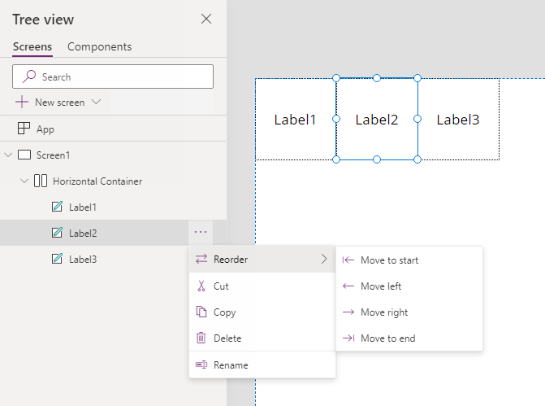

The **Justification**, **Alignment**, and **Align in Container** properties provide additional options for how controls are positioned in the container.

### Justification

The Justification property determines how controls are positioned along the container's *main axis*.

| **Justification** | Icon (Horiztonal Container) | Preview (Horizontal Container) | Icon (Vertical Container) | Preview (Vertical Container) |
| :-: | :-: | :-: | :-: | :-: |
| Start        |  |  |  | 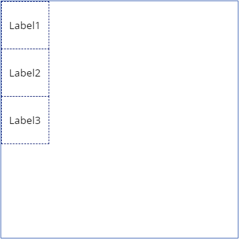 |
| Center       |  | 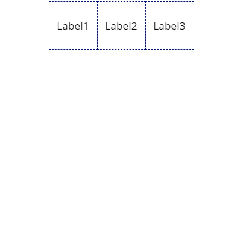 |  | 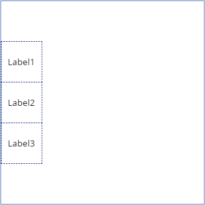 |
| End          |  |  |  | 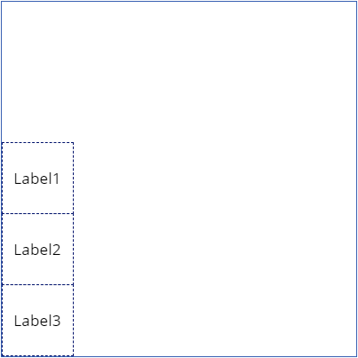 |
| SpaceBetween |  | 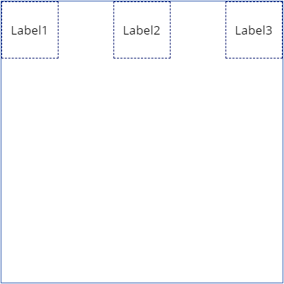 |  | 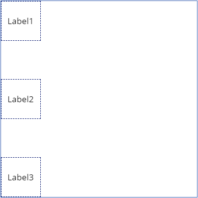 |

### Alignment

The Alignment property determines how controls are positioned along the container's *cross axis*. Note that the Alignment value "Stretch" [also affects a control's size](#sizing-controls-in-responsive-containers).

| **Alignment** | Icon (Horiztonal Container) | Preview (Horizontal Container) | Icon (Vertical Container) | Preview (Vertical Container) |
| :-: | :-: | :-: | :-: | :-: |
| Start        |  | 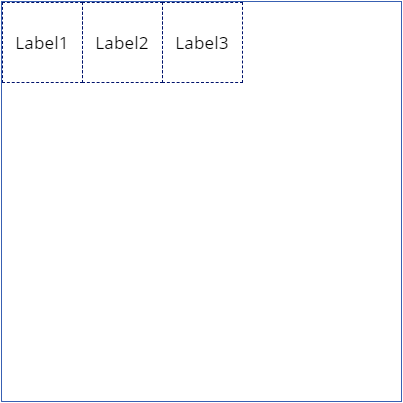 |  |  |
| Center       |  | 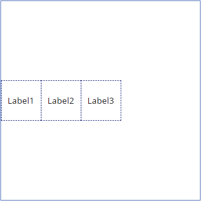 |  | 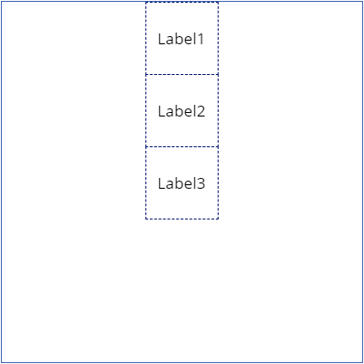 |
| End          |  | 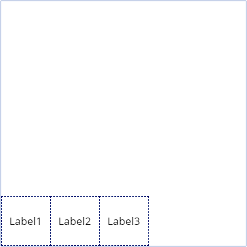 |  | 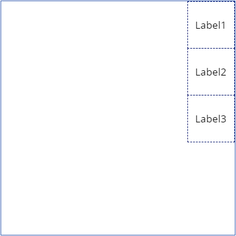 |
| Stretch      |  | 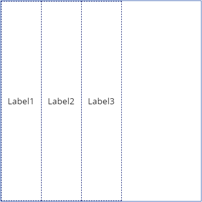 |  | 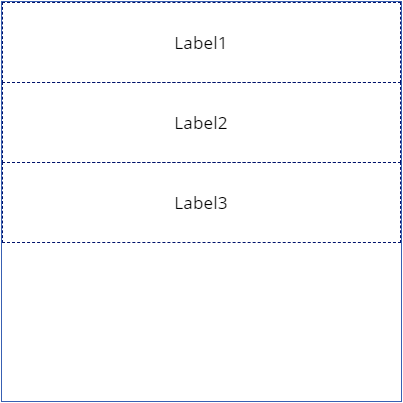 |

### Align in Container

Controls inside of a responsive container have a special property, **Align in Container**. By default, the property value is "SetByContainer", meaning it follows the alignment of the container that it's in. However, you can set the value to "Custom", and it will override the alignment value of the container. In the following example, the container's **Alignment** property is set to "Center" and **Label2** uses a custom **Align in Container** value of "Start".

> [!div class="mx-imgBorder"]
> 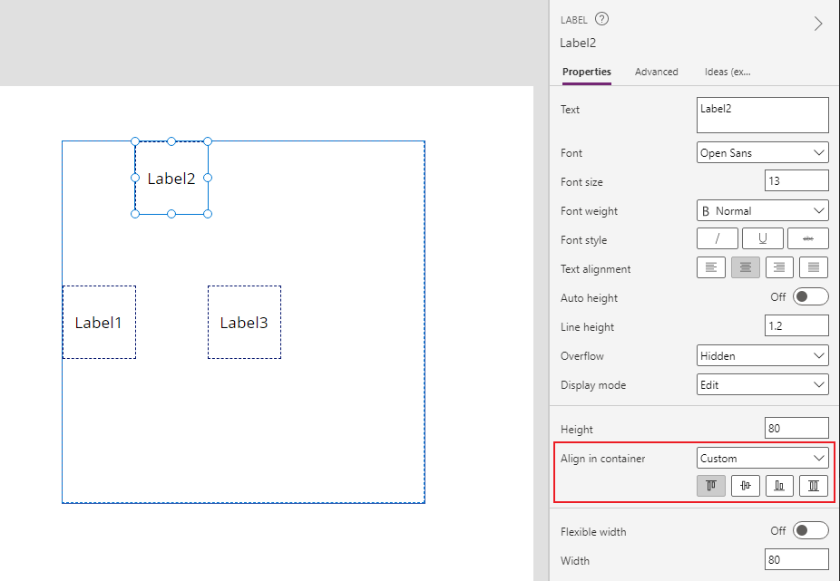

> [!NOTE] The Align in Container property cannot be used if the container's **Wrap** property is enabled.

> [!NOTE] For some controls, including Galleries and Components, the default value of their **Align in Container** property is "Stretch".

## Sizing controls in responsive containers

Controls in a responsive container have the ability to dynamically change their size without the need to write formulas. Controls inside of a responsive container have a special property **Fill portions** (also known as **Flexible Height/Width**), which affects a control's size along its *main axis*. The Alignment and Align in container properties discussed previously, affect a control's size along its *cross axis*.

Whenever a control's height or width is being dynamically changed by either the **FillPortions** or **Alignment** properties, the **Height** and **Width** properties themselves are not used. Instead, the Minimum Height and Minimum Width properties are shown. As the control is being dynamically sized, the Minimum Height/Width properties are used to prevent the controls from shrinking past the minimum.

> [!NOTE] Recall that responsive containers have a main and cross axis, so the minimum dimension shown depends on the direction of the container.
> | Property | Horizontal Container | Vertical Container |
> | - | - | - |
> | FillPortions > 0 | Width is replaced with Minimum Width | Height is replaced with Minimum Height |
> | Alignment: Stretch | Height is replaced with Minimum Height | Width is replaced with Minimum Width |

### Flexible Height/Width (FillPortions)

The **FillPortions** property affects the size of controls along the *main axis* of the container. In the properties pane, this is shown as the **Flexible Height** or **Flexible Width** property, depending on the direction of the container.

If **FillPortions** is 0 (Flexible Height/Width is "Off"), then this property has no effect on the control's size. If **FillPortions** is greater than 0, then the control will expand to take up available space in the main axis of the conatiner. Notice that when **FillPortions** is greater than 0, *Minimum* Height/Width is shown instead of the regular Height/Width property.

The available space is divided among all controls in the container with a nonzero **FillPortions** property. Controls with a larger **FillPortions** get a larger portion of the available space. In the below example, the Red Label has a fill portions of 1, and the Blue Label has a fill portions of 2. Therefore the Red Label takes up &frac12; of the available space and the Blue Label takes up &frac23; of the available space.

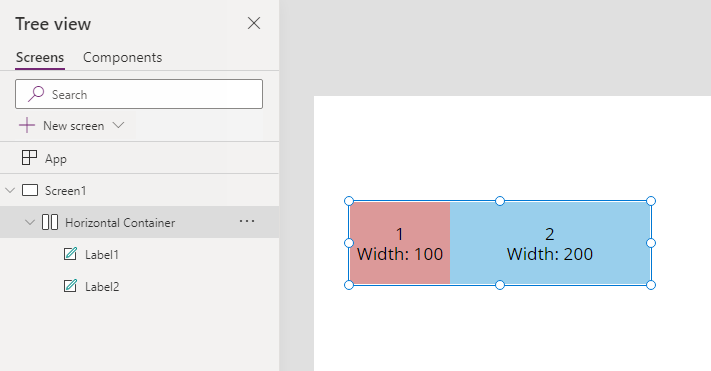

Remember that the Minimum Height/Width properties prevent controls from shrinking smaller than a certain size.

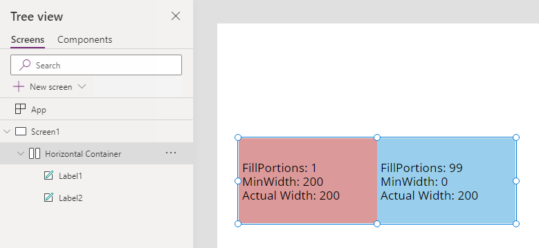

> [!TIP] The total FillPortions of all controls in the container is shown in the properties pane.
>
> 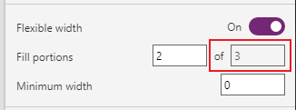

### Alignment

The **Alignment** property (discussed in the [positioning section](#positioning-controls-in-responsive-containers) above) can affect the size of controls along the *cross axis* of the container.

If the **Alignment** property is "Stretch", then the control will expand to take up the available space in the container's cross axis. Notice that when the property is stretch, *Minimum* Height/Width is shown instead of the regular Height/Width property.

# Recipes
## Collapsable grid layout
1. Add a **Vertical container** and set the following properties:
    * X: `0`
    * Y: `0`
    * Height: `Parent.Height`
    * Width: `Parent.Width`
1. Add a **Horizontal container** to **Container1** and set the following properties:
    * Rename the container "Row" for convienience.
    * LayoutAlignItems ("Align (vertical)"): `LayoutAlignItems.Stretch`
    * LayoutWrap ("Wrap"): `true`
    * FillPortions: `0` (equivalently, toggle "Flexible height" OFF in the properties pane).
    * Height: `100`
    * (*optional*) Padding: `10` (for all directions)
    * (*optional*) Gap: `10`
1. Add a **Horizontal container** to **Row** and set the following properties:
    * Rename this container to "Cell" for convienience.
    * LayoutAlignItems ("Align (vertical)"): `LayoutAlignItems.Stretch`
    * LayoutMinHeight ("Minimum height"): `0`
1. Add a **Text label** and **Text input** to **Cell**. The heiarchy in the Tree view should now look like this:

    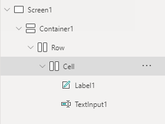

1. Set the following properties on **Label1**:
    * Align ("Text alignment"): `Right`
1. Set the following properties on **TextInput1**:
    * FillPortions: `1` (equivalently, toggle "Flexible height" ON in the properties pane)
    * LayoutMinWidth ("Minimum width"): `150`
1. Set the following properties on **Cell**:
    * LayoutMinWidth ("Minimum width"): `Label1.Width + TextInput1.LayoutMinWidth`

## Start and End Grouping
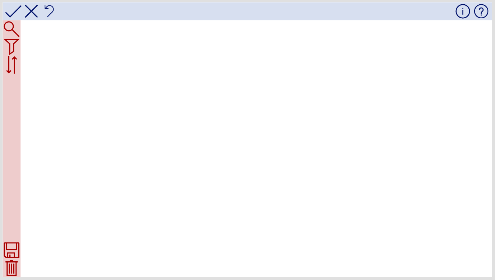

This tutorial will show you how to recreate the horizontal (blue) container in the above example, with three icons aligned left and two icons aligned right. The same steps can be applied to Vertical containers by substituting height for width and vice versa in the instructions.

1. Add a **Horizontal container** and set the following properties:
    * X: `0`
    * Y: `0`
    * Height: `50`
    * Width: `Parent.Width`
    * LayoutAlignItems ("Align (vertical)"): `LayoutAlignItems.Stretch`
    * (*optional*) Fill: `RGBA(215, 223, 240, 1)`
1. Add three Icon controls to the Horizontal container and set the following properties on all of them:
    * Width: `Self.LayoutHeight`
    * LayoutMinWidth ("Minimum width"): `0`
    * LayoutMinHeight ("Minimum height"): `0`
    * (*optional*) Set a desired Icon for each.
    > [!NOTE] LayoutHeight is a read-only property corresponding to the calculated height after the control has been automatically sized by the layout container. Setting Width equal to LayoutHeight ensures that the icon is always square as the height changes dynamically.
1. Add a Container (non-responsive) control to the Horizontal container and set the following properties:
    * LayoutMinWidth ("Minimum width"): `0`
    * LayoutMinHeight ("Minimum height"): `0`
    * *Note*: FillPortions should be set to `1`, but this is the default value for containers-in-containers.
    > [!NOTE] Before adding the remaining icons, ensure that the Horizontal container is selected, otherwise they'll be added to the regular container that was just added.
1. Add two more Icon controls to the Horizontal container and set the following properties on all of them:
    * Width: `Self.LayoutHeight`
    * LayoutMinWidth ("Minimum width"): `0`
    * (*optional*) Set a desired Icon for each.

The resulting heiarchy should look like this:

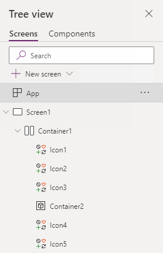

## Scrollable content container with a "floating" button
